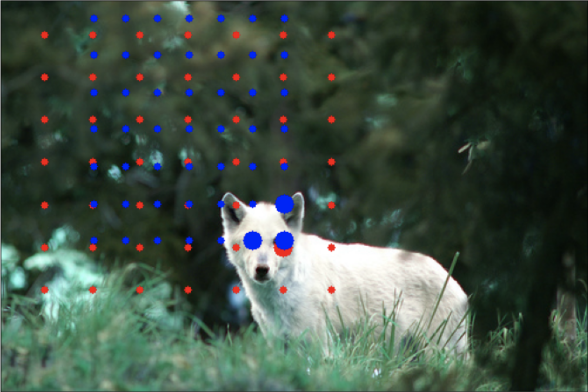
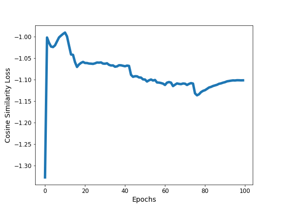

# PixPro -- Pixel-level representation learning

Unofficial implementation of [Propagate Yourself: Exploring Pixel-Level Consistency for Unsupervised Visual Representation Learning](https://arxiv.org/abs/2011.10043).

<figure>
  </img>
  <figcaption>Red and blue points show sampled locations in two image views. Large red dot marks a point in the first view and the large blue dots are "matches" for that pixel in the second view (based off a distance threshold of 0.7).</figcaption>
</figure>


## Pre-trained Weights

First run at pre-training a model is complete. Results fall short of those reported in the PixPro paper, but are on par with other unsupervised pre-training algorithms like MoCo and SimCLR.

<a href="https://www.dropbox.com/s/5vqscsb78p9lg1e/pixpro100_bsz512_IN1M.tar.pth?dl=0">Download weights</a>

<b>Results from VOC2007-test:</b>

Note: I don't have access to an 8 GPU machine to run training with the correct hyperparameters. These results are from training a model with a quarter of the desired batch size (32 instead of 128). While Detectron2 correctly scales the learning rate, it does not correctly scale the number of training iterations. More HPO is required to reproduce the results of the paper, though I'm reasonably confident in the current implementation of the PixPro algorithm. Please open an issue if you'd like to contribute.

<table><tbody>
<!-- START TABLE -->
<!-- TABLE HEADER -->
<th valign="bottom">pretrain</th>
<th valign="bottom">AP50</th>
<th valign="bottom">AP</th>
<th valign="bottom">AP75</th>
<!-- TABLE BODY -->
<tr><td align="left">ImageNet-1M, supervised</td>
<td align="center">81.3</td>
<td align="center">53.5</td>
<td align="center">58.8</td>
</tr>
<tr><td align="left">MoCo v1, 200ep</td>
<td align="center">81.5</td>
<td align="center">55.9</td>
<td align="center">62.6</td>
</tr>
</tr>
<tr><td align="left">SimCLR, 1000ep</td>
<td align="center">81.9</td>
<td align="center">56.3</td>
<td align="center">62.5</td>
</tr>
</tr>
<tr><td align="left"><b>PixPro, 100ep (this repo)</b></td>
<td align="center"><b>81.8</b></td>
<td align="center"><b>56.6</b></td>
<td align="center"><b>63.0</b></td>
</tr>
</tr>
<tr><td align="left">PixPro, 100ep (reported)</td>
<td align="center">83.0</td>
<td align="center">58.8</td>
<td align="center">66.5</td>
</tr>
</tbody></table>

<b>Pretraining hyperparameters:</b>

Again, the choice of hyperparameters is limited by access to computational resources.

<table><tbody>
<!-- START TABLE -->
<!-- TABLE HEADER -->
<th valign="bottom">source</th>
<th valign="bottom">batch size</th>
<th valign="bottom">encoder momentum</th>
<th valign="bottom">epochs</th>
<th valign="bottom">number of gpus</th>
<!-- TABLE BODY -->
<tr><td align="left"><b>PixPro, 100ep (this repo)</b></td>
<td align="center"><b>512</b></td>
<td align="center"><b>0.9934</b></td>
<td align="center"><b>100</b></td>
<td align="center"><b>4</b></td>
</tr>
</tr>
<tr><td align="left">PixPro, 100ep (reported)</td>
<td align="center">1024</td>
<td align="center">0.99</td>
<td align="center">100</td>
<td align="center">8</td>
</tr>
</tbody></table>

<b>PixPro Training Loss</b>

<figure>
  </img>
</figure>


## Current Status

Implementations of the dataloader, model and train_backbone script are complete for Pixel Propagation.

- [x] Pixel propagation module
- [x] Suppport for all spatial transforms (crops, resizing, flips, rotations, grid/elastic deformations, etc.)
- [x] Generic encoder and projection head for any torchvision model
- [x] Consistency loss for pixel propagation (not pixel contrast)
- [x] BYOL-style data augmentations
- [x] Cosine learning rate schedule
- [x] Momentum encoder's momentum schedule from BYOL (0.99 -> 1 during training)
- [x] LARS optimizer
- [x] Distributed training script for backbone network (e.g. resnet50)
- [x] Support for mixed precision training
- [x] Pre-trained ResNet50 backbone model
- [x] Results on COCO and/or PASCAL


Hyperparameters and training schedules have been reproduced with as much fidelity to the original publication as possible.

If using conda, setup a new environment with required dependencies with:

```conda env create -f environment.yml```

Then, on an 8 GPU machine, run:

```
python train_backbone.py {data_directory} {save_directory} -a resnet50 -b 1024 --lr 4 \
--dist-url 'tcp://localhost:10001' --multiprocessing-distributed \
--world-size 1 --rank 0 --momentum 0.9 --fp16
```

Where {data_directory} should be a path to a folder containing ImageNet training data. To train with mixed precision add the ```--fp16``` flag.
